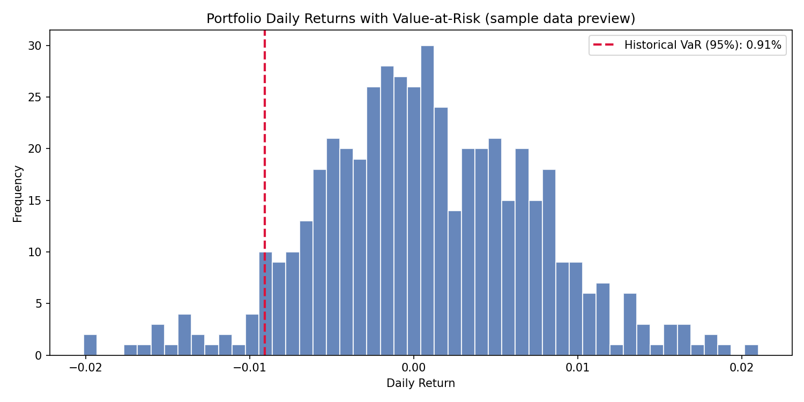

# Portfolio Risk Management System (with a real SQLite database)

A small project that pulls real stock prices from Yahoo
Finance, stores them in a proper SQL database, and calculates
portfolio **Value-at-Risk (VaR)** and a per-asset market risk
breakdown.


The project kept price data only inside the
Python code and adds a real database step: prices are
downloaded once and written into a SQLite table, and every later
calculation reads that data back out with plain SQL — the same
pattern used in real risk/finance systems, just at a small scale.

## Database schema

```sql
CREATE TABLE prices (
    ticker    TEXT NOT NULL,
    date      TEXT NOT NULL,
    adj_close REAL NOT NULL,
    PRIMARY KEY (ticker, date)
);
```

One row per (stock, day). `PRIMARY KEY (ticker, date)` means re-running
the fetch script updates existing rows instead of creating duplicates.

## How it works

1. **`fetch_data.py`** — downloads daily adjusted close prices from
   Yahoo Finance (via `yfinance`) for a list of tickers, and writes
   them into `portfolio.db`.
2. **`risk_analysis.py`** — reads prices back out of the database with
   SQL, computes daily returns, and calculates:
   - **Historical VaR** — looks at the worst real days in the sample
   - **Parametric VaR** — assumes returns are roughly normal, uses
     mean/standard deviation + a z-score
   - **Market risk breakdown** — how much each stock contributes to
     total portfolio risk
3. **`main.py`** — runs the full pipeline end to end and saves a chart
   (`var_distribution.png`) showing the return distribution with the
   VaR line marked.

## Setup

```bash
pip install -r requirements.txt
python main.py
```

This will (re)build `portfolio.db` from live Yahoo Finance data, run
the analysis, print the results, and save the chart. Requires
internet access.

## Default portfolio

| Ticker  | Company        | Weight |
|---------|----------------|--------|
| AAPL    | Apple          | 25%    |
| MSFT    | Microsoft      | 25%    |
| GOOGL   | Alphabet       | 20%    |
| AMZN    | Amazon         | 20%    |
| DBK.DE  | Deutsche Bank  | 10%    |

Deutsche Bank is included deliberately, so this project sits naturally
alongside the DB equity valuation project. Change `TICKERS` and
`WEIGHTS` in `main.py` for a different portfolio.

## Sample output

```
1-day 95% VaR (historical):  0.91%
1-day 95% VaR (parametric):  1.01%
```

Interpretation: on a normal bad day, the portfolio isn't expected to
lose more than about 1% of its value, 95% of the time.



*(Chart above is generated from randomly simulated prices to preview
the output format — running `main.py` replaces it with a chart from
real Yahoo Finance data.)*
